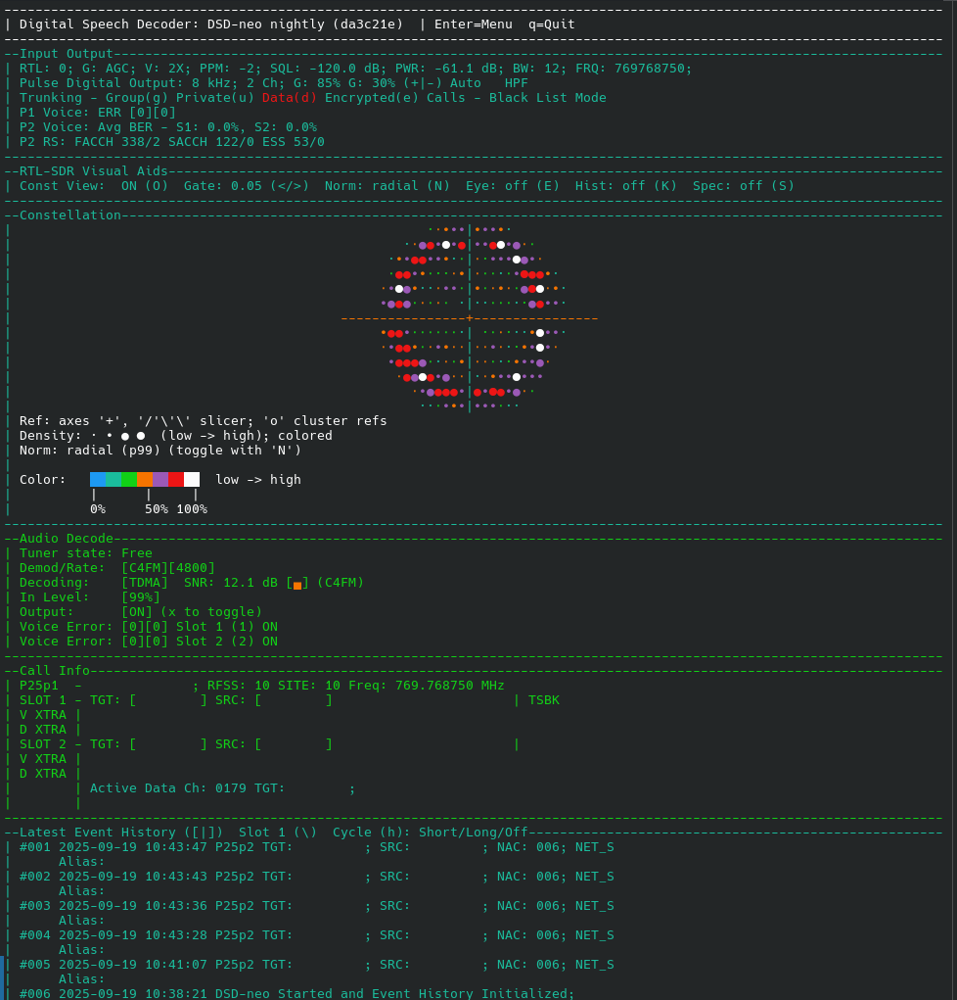

# DSD-neo

A modular and performance‑enhanced version of the well-known Digital Speech Decoder (DSD) with a modern CMake build, split into focused libraries (runtime, DSP, IO, FEC, crypto, protocol, core) and a thin CLI.

Project homepage: https://github.com/arancormonk/dsd-neo

[](https://github.com/arancormonk/dsd-neo/actions/workflows/linux-ci.yaml)
[](https://github.com/arancormonk/dsd-neo/actions/workflows/windows-ci.yaml)
[](https://github.com/arancormonk/dsd-neo/actions/workflows/macos-ci.yaml)



## Downloads

- Stable releases: https://github.com/arancormonk/dsd-neo/releases
  - Linux AppImage (x86_64): dsd-neo-linux-x86_64-portable-<version>.AppImage
  - Linux AppImage (aarch64): dsd-neo-linux-aarch64-portable-<version>.AppImage
  - macOS DMG (arm64): dsd-neo-macos-arm64-portable-<version>.dmg
  - Windows ZIP (x86_64): dsd-neo-cygwin-x86_64-portable-<version>.zip
- Nightly builds: https://github.com/arancormonk/dsd-neo/releases/tag/nightly
  - Linux AppImage (x86_64): dsd-neo-linux-x86_64-portable-nightly.AppImage
  - Linux AppImage (aarch64): dsd-neo-linux-aarch64-portable-nightly.AppImage
  - macOS DMG (arm64): dsd-neo-macos-arm64-portable-nightly.dmg
  - Windows ZIP (x86_64): dsd-neo-cygwin-x86_64-portable-nightly.zip

## Project Status

This project is an active work in progress as we decouple from the upstream fork and continue modularization. Expect breaking changes to build presets, options, CLI flags, and internal library boundaries while this stabilization work proceeds. The main branch may be volatile; for deployments, prefer building a known commit. Issues and PRs are welcome—please include logs and reproduction details when reporting regressions.

## Overview

- A performance‑enhanced fork of [lwvmobile/dsd-fme](https://github.com/lwvmobile/dsd-fme), which is a fork of [szechyjs/dsd](https://github.com/szechyjs/dsd)
- Modularized fork with clear boundaries: `runtime`, `dsp`, `io`, `fec`, `crypto`, `protocol`, `core`, plus `ui` and a CLI app.
- Protocol coverage: DMR, dPMR, D‑STAR, NXDN, P25 Phase 1/2, X2‑TDMA, EDACS, ProVoice, M17, YSF.
- Integrates with [arancormonk/mbelib-neo](https://github.com/arancormonk/mbelib-neo) for IMBE/AMBE vocoder primitives; falls back to legacy MBE if needed.
- Public headers installed under `include/dsd-neo/...` and included via `#include <dsd-neo/<module>/<header>>`.

## Build From Source

Requirements

- C compiler with C11 and C++ compiler with C++14 support.
- CMake ≥ 3.20.
- Dependencies:
  - Required: libsndfile, ITPP, ncurses (wide), PulseAudio.
  - Optional: librtlsdr (RTL‑SDR support), Codec2 (additional vocoder paths), help2man (man page generation).
  - Vocoder: prefers mbelib‑neo CMake package (`mbe-neo`); otherwise uses legacy `MBE` find module.

Using CMake presets (recommended)

```
# From the repository root

# Debug build
cmake --preset dev-debug
cmake --build --preset dev-debug -j

# Release build (can enable fast-math/LTO/IPO)
cmake --preset dev-release
cmake --build --preset dev-release -j

# Run smoke tests (future CI; no dedicated unit tests yet)
ctest --preset dev-debug -V
```

Notes

- Presets create out‑of‑source builds under `build/<preset>/`. Run from the repo root.
- The CLI binary outputs to `build/<preset>/apps/dsd-cli/dsd-neo`.

Manual configure/build

```
mkdir -p build && cd build
cmake ..
cmake --build . -j
```

## Install / Uninstall

```
# Single-config generators (Unix Makefiles/Ninja):
cmake --install build/dev-release

# Multi-config generators (Visual Studio/Xcode):
cmake --install build/dev-release --config Release

# Uninstall from the same build directory
cmake --build build/dev-release --target uninstall
```

## Configuration Options

- Build hygiene and optimization:
  - `-DDSD_ENABLE_WARNINGS=ON` — Enable common warnings (default ON).
  - `-DDSD_WARNINGS_AS_ERRORS=ON` — Treat warnings as errors.
  - `-DDSD_ENABLE_FAST_MATH=ON` — Enable fast‑math (`-ffast-math`/`/fp:fast`) across targets.
  - `-DDSD_ENABLE_LTO=ON` — Enable IPO/LTO in Release builds (when supported).
  - `-DDSD_ENABLE_NATIVE=ON` — Enable `-march=native -mtune=native` (non‑portable binaries).
  - `-DDSD_ENABLE_ASAN=ON` — AddressSanitizer in Debug builds.
  - `-DDSD_ENABLE_UBSAN=ON` — UndefinedBehaviorSanitizer in Debug builds.
- UI and behavior toggles:
  - `-DCOLORS=OFF` — Disable ncurses color output.
  - `-DCOLORSLOGS=OFF` — Disable colored terminal/log output.
- Protocol and feature knobs:
  - `-DPVC=ON` — Enable ProVoice Conventional Frame Sync.
  - `-DLZ=ON` — Enable LimaZulu‑requested NXDN tweaks.
  - `-DSID=ON` — Enable experimental P25p1 Soft ID decoding.
- Optional backends (auto‑detected):
  - `RTLSDR_FOUND` — Builds RTL‑SDR radio front‑end (`-DUSE_RTLSDR`).
  - `CODEC2_FOUND` — Enables Codec2 support (`-DUSE_CODEC2`).

## Using The CLI

- Binary path: `build/<preset>/apps/dsd-cli/dsd-neo`
- Show help/usage: `dsd-neo -h`
- Common inputs:
  - PulseAudio input: `-i pulse` (default). List devices: `-O`.
  - WAV input (48 kHz mono): `-i file.wav` or with custom rate `-s 96000`.
  - RTL‑SDR: `-i rtl` for defaults, or `-i rtl:dev:freq:gain:ppm:bw:sql:vol[:bias[=on|off]]`.
  - RTL‑TCP: `-i rtltcp[:host:port]` (default 127.0.0.1:1234). Optional trailing fields mirror RTL‑SDR, including `bias` (forwarded to the rtl_tcp server when supported).
  - TCP (SDR++ / GRC): `-i tcp[:host:port]` (default port 7355).
  - M17 UDP/IP: `-i m17udp[:bind_addr:port]` and/or `-o m17udp[:host:port]`.
- Quick examples:
  - Play saved MBE files: `dsd-neo -r *.mbe`
  - Trunking with TCP control: `dsd-neo -fs -i tcp -U 4532 -T -C dmr_t3_chan.csv -G group.csv -N 2> log.txt`
  - Trunking with RTL‑SDR: `dsd-neo -fs -i rtl:0:450M:26:-2:8 -T -C connect_plus_chan.csv -G group.csv -N 2> log.txt`

If `help2man` is available during build, a `dsd-neo(1)` man page is generated and installed from the binary’s `-h` output.

## Tests and Examples

- Run: `ctest --preset dev-debug -V`.
- No dedicated unit tests yet; CTest is wired for future smoke tests and CI. Prefer small, testable helpers when contributing.

## Documentation

- Module overview and targets are documented in `docs/code_map.md`.
- Build presets are defined in `CMakePresets.json`.

## Project Layout

- Apps: `apps/dsd-cli` — CLI entrypoint, target `dsd-neo`.
- Core: `src/core`, headers `<dsd-neo/core/...>` — glue (audio, vocoder, frame dispatch, GPS, file import).
- Runtime: `src/runtime`, headers `<dsd-neo/runtime/...>` — config, logging, aligned memory, rings, worker pool, RT scheduling, git version.
- DSP: `src/dsp`, headers `<dsd-neo/dsp/...>` — demod pipeline, resampler, filters, FLL/TED, SIMD helpers.
- IO: `src/io`, headers `<dsd-neo/io/...>` — radio (RTL‑SDR), audio backends (PortAudio, PulseAudio), control (UDP/rigctl/serial).
- FEC: `src/fec`, headers `<dsd-neo/fec/...>` — BCH, Golay, Hamming, RS, BPTC, CRC/FCS.
- Crypto: `src/crypto`, headers `<dsd-neo/crypto/...>` — RC2/RC4/DES/AES and helpers.
- Protocols: `src/protocol/<name>`, headers `<dsd-neo/protocol/<name>/...>` — DMR, dPMR, D‑STAR, NXDN, P25, X2‑TDMA, EDACS, ProVoice, M17, YSF.
- Third‑party: `src/third_party/ezpwd` — INTERFACE target `dsd-neo_ezpwd`.

## Tooling

- Format: `tools/format.sh` (requires `clang-format`; see `.clang-format`).
- Static analysis: `clang-tidy -p build/dev-debug <files>` (config in `.clang-tidy`).
- Git hooks: `tools/install-git-hooks.sh` enables auto‑format on commit.

## Contributing

- Languages: C (C11) and C++ (C++14). Indent width 4 spaces; no tabs; brace all control statements; line length ≤ 120.
- Use project‑prefixed includes only: `#include <dsd-neo/...>`.
- Before sending changes: build presets you touched, run `tools/format.sh`, address feasible clang‑tidy warnings.

## License

- Project license: GPL‑2.0‑or‑later (see `LICENSE`).
- Portions remain under ISC per the original DSD author (see `COPYRIGHT`).
