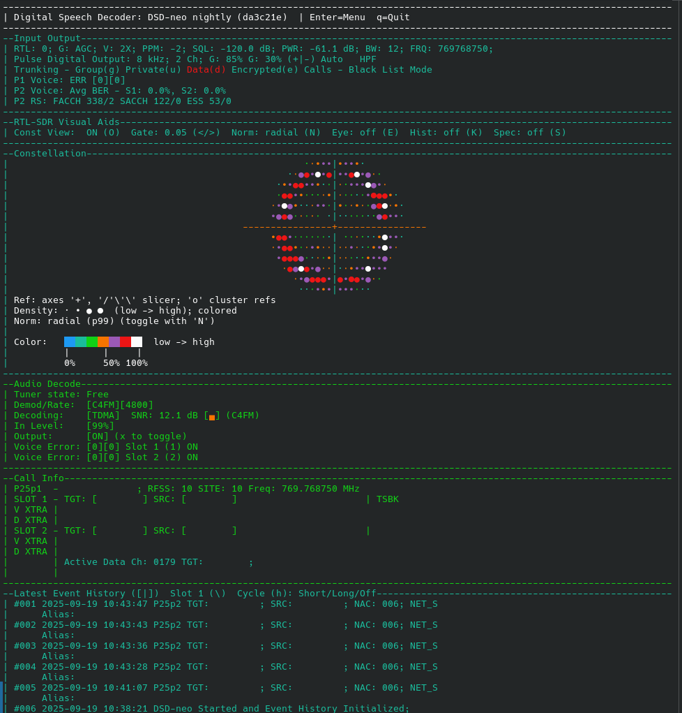

# DSD-neo

A modular and performance‑enhanced version of the well-known Digital Speech Decoder (DSD) with a modern CMake build, split into focused libraries (`runtime`, `platform`, `dsp`, `io`, `engine`, `fec`, `crypto`, `protocol`, `core`, `ui`) and a thin CLI.

Project homepage: https://github.com/arancormonk/dsd-neo

[](https://github.com/arancormonk/dsd-neo/actions/workflows/linux-ci.yaml)
[](https://github.com/arancormonk/dsd-neo/actions/workflows/windows-ci.yaml)
[](https://github.com/arancormonk/dsd-neo/actions/workflows/macos-ci.yaml)
[](https://www.bestpractices.dev/projects/12978)
[](https://www.bestpractices.dev/projects/12978)



## Downloads

- Stable releases: see [GitHub Releases](https://github.com/arancormonk/dsd-neo/releases)
  - Linux AppImage (x86_64): `dsd-neo-linux-x86_64-portable-<version>.AppImage`
  - Linux AppImage (aarch64): `dsd-neo-linux-aarch64-portable-<version>.AppImage`
  - macOS DMG (arm64): `dsd-neo-macos-arm64-portable-<version>.dmg`
  - Windows native ZIP (MSVC x86_64): `dsd-neo-msvc-x86_64-native-<version>.zip`
- Nightly builds:
  - Linux AppImage (x86_64): [dsd-neo-linux-x86_64-portable-nightly.AppImage](https://github.com/arancormonk/dsd-neo/releases/download/nightly/dsd-neo-linux-x86_64-portable-nightly.AppImage)
  - Linux AppImage (aarch64): [dsd-neo-linux-aarch64-portable-nightly.AppImage](https://github.com/arancormonk/dsd-neo/releases/download/nightly/dsd-neo-linux-aarch64-portable-nightly.AppImage)
  - macOS DMG (arm64): [dsd-neo-macos-arm64-portable-nightly.dmg](https://github.com/arancormonk/dsd-neo/releases/download/nightly/dsd-neo-macos-arm64-portable-nightly.dmg)
  - Windows native ZIP (MSVC x86_64): [dsd-neo-msvc-x86_64-native-nightly.zip](https://github.com/arancormonk/dsd-neo/releases/download/nightly/dsd-neo-msvc-x86_64-native-nightly.zip)
- Arch Linux (AUR): [dsd-neo](https://aur.archlinux.org/packages/dsd-neo) for stable releases,
  or [dsd-neo-git](https://aur.archlinux.org/packages/dsd-neo-git) for main-branch snapshots.

## Project Status

This project is an active work in progress as we decouple from the upstream fork and continue modularization. Expect breaking changes to build presets, options, CLI flags, and internal library boundaries while this stabilization work proceeds. The main branch may be volatile; for deployments, prefer building a known commit. Issues and PRs are welcome—please include logs and reproduction details when reporting regressions.

## Overview

- A performance‑enhanced fork of [lwvmobile/dsd-fme](https://github.com/lwvmobile/dsd-fme), which is a fork of [szechyjs/dsd](https://github.com/szechyjs/dsd)
- Modularized fork with clear boundaries: `runtime`, `platform`, `dsp`, `io`, `engine`, `fec`, `crypto`, `protocol`, `core`, plus `ui` and a CLI app.
- Protocol coverage: DMR, dPMR, D‑STAR, NXDN, P25 Phase 1/2, X2‑TDMA, EDACS, ProVoice, M17
  (RF/UDP LSF, stream, packet, BERT), YSF.
- Requires [arancormonk/mbelib-neo](https://github.com/arancormonk/mbelib-neo) 2.x for IMBE/AMBE vocoder primitives.
- Public headers live under `include/dsd-neo/...` and are included as `#include <dsd-neo/<module>/<header>>`.

## How DSD‑neo Is Different

- More input and streaming options

  - Direct RTL‑SDR USB, plus RTL‑TCP (`-i rtltcp[:host:port]`) and SoapySDR (`-i soapy[:args]`) for non-RTL radios (for example Airspy/SDRplay/HackRF/LimeSDR).
  - Generic TCP PCM16LE input (`-i tcp[:host:port]`, SDR++/GRC 7355 audio streams).
  - UDP audio in/out: receive PCM16LE over UDP as an input, and send decoded audio to UDP sinks for easy piping to other apps or hosts (decoded voice is typically 8 kHz; see `docs/network-audio.md`).
  - M17 UDP/IP in/out: dedicated M17 stream and packet frame input/output over UDP (`-i m17udp[:bind:17000]`, `-o m17udp[:host:17000]`).
  - RF I/Q capture/replay workflow with metadata (`--iq-capture`, `--iq-info`, `--iq-replay`) for reproducible decode debugging and regression replay.

- Built‑in trunking workflow

  - Follow P25 and DMR trunked voice automatically using channel maps and group lists (`-C ...csv`, `-G group.csv`, `-T`, `-N`).
  - Rotate one tuner across CSV-defined P25 trunk, DMR trunk, and one-frequency DMR targets with `--trunk-scan targets.csv`.
  - On‑the‑fly retune control via rigctl (`-U`) for external SDR front-ends (e.g., SDR++). For RTL/RTL‑TCP input, DSD-neo retunes directly (optional external UDP retune control can be enabled on loopback with `--rtl-udp-control <port>`; remote exposure requires `--rtl-udp-control-bind <ipv4>`; see `docs/udp-control.md`).

- RTL‑SDR quality‑of‑life features

  - Bias‑tee control (when supported by your librtlsdr), manual or auto gain, power squelch, adjustable tuner bandwidth, and per‑run PPM correction.
  - Optional carrier/error-based auto‑PPM drift correction with SNR/power gating and short training/lock, for long unattended runs.
  - rtl_tcp niceties: configurable prebuffering to reduce dropouts and settings tuned for stable network use.

- RTL‑SDR optimizations and diagnostics

  - RTL USB, RTL-TCP, SoapySDR, and IQ replay digital decode are symbol-domain: FSK and CQPSK paths feed normalized
    float symbols to the decoder, with source monitor audio handled by a separate tap.
  - Real‑time visual aids in the terminal for faster setup and troubleshooting:
    - Constellation view with adjustable gating and normalization.
    - Eye diagram (Unicode/ASCII, optional color) with adaptive scales and level guides.
    - Spectrum analyzer with adjustable FFT size.
    - FSK 4‑level histogram and live per‑modulation SNR readouts.
  - Heavily optimized RTL path for smoother audio and fewer dropouts:
    - One‑pass byte→I/Q widening with optional 90° rotation and DC‑spur fs/4 capture shift (configurable).
    - Cascaded decimation and an optional rational resampler to keep processing efficient and responsive.
    - Optional auto‑PPM correction from the timing error detector for long unattended runs.
  - Device control from the UI: toggle bias‑tee, switch AGC/manual gain, adjust bandwidth and squelch, and retune quickly.

- Enhanced M17 support

  - RF and UDP/IP paths cover LSF, stream, packet, BERT, EOT, UDP/IP control, and MPKT frames.
  - Decode support includes current LSF TYPE fields, CAN filtering, address classes, meta text/GNSS/extended callsign, SMS/TLE packets, 823-byte packet assembly/CRC, BERT PRBS9 checks, scrambler/AES-CTR receive, and optional signed-stream verification.
  - Encoders generate stream voice (`-fZ`), packet (`-fP`), and BERT (`-fB`) RF frames for test/airgap workflows; see [docs/m17-support.md](docs/m17-support.md) for scope and non-goals.

- Expanded DSP controls for power users

  - Changes apply instantly from the UI and persist across retunes.
  - See [docs/cli.md](docs/cli.md) for environment variable reference.

- Portable, ready‑to‑run builds
  - Linux AppImage, macOS DMG, and Windows portable ZIP releases.

### How this compares at a glance

- Versus DSD‑FME: similar protocol coverage and UI heritage, but DSD‑neo adds a broader M17 implementation than FME's simplified stream decoder: RF/UDP LSF, packet, BERT, EOT, MPKT, packet CRC assembly, AES-CTR receive, signed-stream verification, and stream/packet/BERT encoders. It also adds network‑friendly I/O (UDP audio in), refined RTL‑TCP handling (prebuffer, tuned defaults), optional auto‑PPM, and packaged cross‑platform binaries.
- Versus the original DSD: more protocols (notably P25 Phase 2, M17, YSF, EDACS), built‑in trunking, network inputs, device control, and an interactive UI.

## Build From Source

Requirements

- C compiler with C11 and C++ compiler with C++14 support.
- CMake ≥ 3.20.
- Dependencies:
  - Required: libsndfile; OpenSSL 3.x libcrypto; a curses backend (ncursesw/PDCurses); and an audio backend (PulseAudio by default, PortAudio on Windows).
  - Optional: librtlsdr (RTL‑SDR support), SoapySDR >= 0.8.1 (non‑RTL SDR backends), Codec2 (additional vocoder paths), libcurl (rdio API uploads), PortAudio on non-Windows builds, help2man (man page generation).
  - Vocoder: mbelib-neo 2.x (`mbe-neo` CMake package) is required.

OS package hints

- Linux bootstrap helper:
  - `tools/install_linux.sh --yes` installs distro build dependencies, builds pinned `mbelib-neo`, builds this checkout, smoke-tests the CLI, and installs through CMake.
  - See `docs/linux-installation.md` for distro coverage and Docker validation with `tools/docker_linux_install_matrix.sh`.
- Ubuntu/Debian (apt):
  - `sudo apt-get update && sudo apt-get install -y build-essential cmake ninja-build libssl-dev libsndfile1-dev libpulse-dev libncurses-dev librtlsdr-dev libsoapysdr-dev`
  - Older distro packages may provide unsupported SoapySDR 0.7.x; install or build SoapySDR 0.8.1 or newer when enabling that backend.
- macOS (Homebrew):
  - `brew install cmake ninja openssl libsndfile ncurses pulseaudio librtlsdr soapysdr codec2`
- Windows:
  - Preferred binary: the native MSVC ZIP.
  - Source builds use CMake presets with vcpkg; set `VCPKG_ROOT` and use `win-msvc-*` presets in `CMakePresets.json`.

MBE vocoder dependency (mbelib-neo)

DSD‑neo requires the `mbe-neo` 2.x CMake package (from `mbelib-neo`) with the soft-decision/V2 API. The older 1.x mbelib-neo releases are not supported. If CMake fails with “could not find mbe-neo”, install it and re-run configure.

Example (Linux/macOS):

```bash
# Build and install mbelib-neo (once)
git clone https://github.com/arancormonk/mbelib-neo
cmake -S mbelib-neo -B mbelib-neo/build -DCMAKE_BUILD_TYPE=Release
cmake --build mbelib-neo/build -j
cmake --install mbelib-neo/build --prefix "$HOME/.local"

# Linux: user-prefix installs need this when running installed binaries.
export LD_LIBRARY_PATH="$HOME/.local/lib:$HOME/.local/lib64${LD_LIBRARY_PATH:+:$LD_LIBRARY_PATH}"
# Linux: if you install mbelib-neo to /usr or /usr/local instead, run:
# sudo ldconfig

# Then configure dsd-neo (point CMake to the install prefix)
cmake --preset dev-release -DCMAKE_PREFIX_PATH="$HOME/.local"
```

Build recipes (copy/paste)

### Linux/macOS — release build (preset `dev-release`, recommended)

```bash
# From the repository root.
#
# OS deps (examples):
# - Ubuntu/Debian: sudo apt-get update && sudo apt-get install -y build-essential cmake ninja-build libssl-dev libsndfile1-dev libpulse-dev libncurses-dev librtlsdr-dev libsoapysdr-dev
#   Older distro packages may need a separate SoapySDR 0.8.1+ install.
# - macOS:         brew install cmake ninja openssl libsndfile ncurses pulseaudio librtlsdr soapysdr codec2
#
# Install is optional; you can run directly from the build tree.

cmake --preset dev-release
cmake --build --preset dev-release -j

# Run (no install required)
build/dev-release/apps/dsd-cli/dsd-neo -h

# Install (optional; pick one)
cmake --install build/dev-release --prefix "$HOME/.local"
# sudo cmake --install build/dev-release
```

### Linux/macOS — debug build + tests (preset `dev-debug`)

```bash
# OS deps (examples):
# - Ubuntu/Debian: sudo apt-get update && sudo apt-get install -y build-essential cmake ninja-build libssl-dev libsndfile1-dev libpulse-dev libncurses-dev librtlsdr-dev libsoapysdr-dev
#   Older distro packages may need a separate SoapySDR 0.8.1+ install.
# - macOS:         brew install cmake ninja openssl libsndfile ncurses pulseaudio librtlsdr soapysdr codec2

cmake --preset dev-debug
cmake --build --preset dev-debug -j
ctest --preset dev-debug --output-on-failure

# Optional race-detection pass. Keep it separate from ASan/UBSan.
cmake --preset tsan-debug
cmake --build --preset tsan-debug -j
ctest --preset tsan-debug --output-on-failure
# The preset applies tools/tsan.supp for known third-party PulseAudio runtime reports.

# Run (no install required)
build/dev-debug/apps/dsd-cli/dsd-neo -h
```

### Manual configure/build (no presets)

```bash
# Use a build directory that isn't a preset (so you don't expect build/dev-release to exist).
cmake -S . -B build/manual -DCMAKE_BUILD_TYPE=Release
cmake --build build/manual -j

# Run (no install required)
build/manual/apps/dsd-cli/dsd-neo -h

# Install (optional; pick one)
cmake --install build/manual --prefix "$HOME/.local"
# sudo cmake --install build/manual
```

### Coverage (optional)

```bash
tools/coverage.sh  # generates build/coverage-debug/coverage_html
```

Notes

- Presets live in `CMakePresets.json`.
- Presets create out‑of‑source builds under `build/<preset>/`. Run from the repo root.
- The CLI binary outputs to `build/<preset>/apps/dsd-cli/dsd-neo`.
- `cmake --install <build_dir>` only works if you configured that build directory. If you're inside the build directory, use `cmake --install .`.
- If `cmake --install build/dev-release` fails and `build/dev-release/` doesn't exist, you likely did a manual build (install from your actual build dir).
- On Linux, installed binaries must be able to find `libmbe-neo.so.2`. For `/usr` or `/usr/local` installs, run `sudo ldconfig` after installing `mbelib-neo`; for `$HOME/.local`, export `LD_LIBRARY_PATH` as shown above.

## Install / Uninstall

```bash
# Preset builds (recommended)
# Single-config generators (Unix Makefiles/Ninja):
cmake --install build/dev-release --prefix "$HOME/.local"

# Multi-config generators (Visual Studio/Xcode):
cmake --install build/dev-release --config Release --prefix "$HOME/.local"

# Manual build directory (example above uses `build/manual/`):
cmake --install build/manual --prefix "$HOME/.local"
# cmake --install build --prefix "$HOME/.local"  # if you configured into `build/`

# Uninstall from the same build directory
cmake --build build/dev-release --target uninstall  # preset build
cmake --build build/manual --target uninstall       # manual build directory
# cmake --build build --target uninstall            # if you configured into `build/`
```

## Build Options

These are CMake cache options (set at configure time via `-D...`).

- Build hygiene and optimization:
  - `-DDSD_ENABLE_WARNINGS=ON` — Enable common warnings (default ON).
  - `-DDSD_WARNINGS_AS_ERRORS=ON|OFF` — Treat warnings as errors (default ON).
  - `-DDSD_ENABLE_FAST_MATH=ON` — Enable fast‑math (`-ffast-math`/`/fp:fast`) across targets.
  - `-DDSD_ENABLE_LTO=ON` — Enable IPO/LTO in Release builds (when supported).
  - `-DDSD_ENABLE_HARDENING=ON|OFF` — Enable supported Release-like compiler/linker hardening (default ON).
  - `-DDSD_ENABLE_NATIVE=ON` — Enable `-march=native -mtune=native` (non‑portable binaries).
  - `-DDSD_ENABLE_ASAN=ON` — AddressSanitizer in Debug builds.
  - `-DDSD_ENABLE_UBSAN=ON` — UndefinedBehaviorSanitizer in Debug builds.
  - `-DDSD_ENABLE_TSAN=ON` — ThreadSanitizer in Debug builds; use a separate build from ASan/UBSan.
  - `-DDSD_ENABLE_FUZZING=ON` — Enable libFuzzer instrumentation and fuzz targets (Clang/libFuzzer builds).
- Audio backend selection:
  - `-DDSD_USE_PORTAUDIO=ON` — Use PortAudio instead of PulseAudio (default on Windows).
- Radio backend selection:
  - `-DDSD_ENABLE_RTLSDR=ON|OFF` — Enable/disable RTL-SDR backend discovery.
  - `-DDSD_ENABLE_SOAPYSDR=ON|OFF` — Enable/disable SoapySDR backend discovery.
  - `-DDSD_REQUIRE_RTLSDR=ON|OFF` — Fail configure when RTL-SDR is enabled but unavailable.
  - `-DDSD_REQUIRE_SOAPYSDR=ON|OFF` — Fail configure when SoapySDR >= 0.8.1 is enabled but unavailable.
- UI and behavior toggles:
  - `-DDSD_ENABLE_TERMINAL_UI=ON|OFF` — Build the ncurses/PDCurses terminal frontend (default ON).
  - `-DDSD_ENABLE_NATIVE_UI=ON|OFF` — Build the native frontend scaffold (default OFF).
  - `-DCOLORS=OFF` — Disable ncurses color output.
  - `-DCOLORSLOGS=OFF` — Disable colored terminal/log output.
- Protocol and feature knobs:
  - `-DPVC=ON` — Enable ProVoice Conventional Frame Sync.
  - `-DLZ=ON` — Enable LimaZulu‑requested NXDN tweaks.
  - `-DSID=ON` — Enable experimental P25p1 Soft ID decoding.
- Optional features (auto‑detected):
  - RTL‑SDR support is enabled when `librtlsdr` is found.
  - SoapySDR support is enabled when SoapySDR >= 0.8.1 is found through a CMake package that exports an imported target.
  - Codec2 support is enabled when `codec2` is found.
  - rdio API upload support is enabled when libcurl is found.

## CI Backend Policy

- CI treats backend availability as a build contract, not a best-effort option.
- Linux CI runs a backend matrix for `both`, `soapy_only`, `rtl_only`, and `neither`.
- Release/packaging/static-analysis jobs that are expected to exercise radio backends configure with:
  - `-DDSD_REQUIRE_RTLSDR=ON`
  - `-DDSD_REQUIRE_SOAPYSDR=ON`
- If either required backend is missing, configure fails fast.

## Backend Matrix Reproduction (Local)

Run from repo root after installing deps (`librtlsdr` and SoapySDR when required):

```bash
# both backends required
cmake --preset dev-debug \
  -DDSD_ENABLE_RTLSDR=ON -DDSD_REQUIRE_RTLSDR=ON \
  -DDSD_ENABLE_SOAPYSDR=ON -DDSD_REQUIRE_SOAPYSDR=ON
cmake --build --preset dev-debug -j

# soapy_only
cmake --preset dev-debug \
  -DDSD_ENABLE_RTLSDR=OFF \
  -DDSD_ENABLE_SOAPYSDR=ON -DDSD_REQUIRE_SOAPYSDR=ON
cmake --build --preset dev-debug -j

# rtl_only
cmake --preset dev-debug \
  -DDSD_ENABLE_RTLSDR=ON -DDSD_REQUIRE_RTLSDR=ON \
  -DDSD_ENABLE_SOAPYSDR=OFF
cmake --build --preset dev-debug -j

# neither
cmake --preset dev-debug \
  -DDSD_ENABLE_RTLSDR=OFF \
  -DDSD_ENABLE_SOAPYSDR=OFF
cmake --build --preset dev-debug -j
```

CI-like strict scan-build run:

```bash
tools/scan_build.sh --strict \
  --cmake-arg -DDSD_REQUIRE_RTLSDR=ON \
  --cmake-arg -DDSD_REQUIRE_SOAPYSDR=ON
```

## Runtime Tuning

Most users can run with defaults. For advanced tuning, see [docs/cli.md](docs/cli.md).

Common options:

- Auto‑PPM drift correction (RTL‑SDR): `--auto-ppm`
- RTL‑TCP adaptive buffering: `--rtltcp-autotune`
- Rig control (SDR++): `-U 4532` (default port), `-B <Hz>` (bandwidth)

## SoapySDR Quickstart

- Use SoapySDR when your hardware is not accessed through `librtlsdr` directly.
- Build with Soapy enabled (`-DDSD_ENABLE_SOAPYSDR=ON`) and optionally require it (`-DDSD_REQUIRE_SOAPYSDR=ON`);
  DSD-neo requires SoapySDR >= 0.8.1 for this backend.
- Install SoapySDR tools and the Soapy module for your radio; verify with `SoapySDRUtil --info` and discover args with
  `SoapySDRUtil --find`.
- Run with `-i soapy[:args]`. The `soapy:` string selects backend/device only; set tuning via `rtl_*` keys (at minimum
  `rtl_freq`; easiest via config). See the guide for a minimal config snippet.
- SoapySDR digital decode uses the same normalized symbol-domain path as RTL USB/RTL-TCP/IQ replay; `rtl_volume` only
  affects monitor and other non-symbol audio.
- Full guide: `docs/soapysdr.md`.

## Using The CLI

- See the friendly CLI guide: [docs/cli.md](docs/cli.md)
  - Or run `dsd-neo -h` for quick usage in your terminal.
  - Digital/analog output gain: `-g <float>` (digital; `0` = auto, `1` ≈ 2%, `50` = 100%) and `-n <float>` (analog 0–100%).
  - DMR mono helpers:
    - Modern form: `-fs -nm` (DMR BS/MS simplex + mono audio).
    - Legacy alias: `-fr` (kept as a shorthand for the same DMR‑mono profile).
  - Single-tuner trunk scan workflow: `docs/trunk-scan.md`
  - CSV formats (channel maps, trunk scan targets, group lists, key lists): `docs/csv-formats.md` (examples in `examples/`)

Quick examples

- UDP in → Pulse out with UI: `dsd-neo -i udp -o pulse -N`
- DMR trunking from TCP PCM input (with rigctl): `dsd-neo -fs -i tcp -U 4532 -T -C dmr_t3_chan.csv -G group.csv -N`
- Single-tuner P25/DMR trunk scan from RTL-SDR: `dsd-neo -ft -i rtl:0:851.0125M:22:0:48:0:2 --trunk-scan examples/trunk_scan_targets.csv -G examples/group.csv -N`
- IQ capture + inspect + replay: `dsd-neo -i rtl:0:851.375M:22:0:48:0:2 --iq-capture p25-control.iq -N` then `dsd-neo --iq-info p25-control.iq.json` then `dsd-neo --iq-replay p25-control.iq.json -f1 -N`

## Configuration

- INI‑style user config is implemented for stable defaults (input/output/mode/trunking); see `docs/config-system.md`.
- Config loading is opt-in: use `--config` to enable (optionally with a path), set `DSD_NEO_CONFIG=<path>`, or pass a single positional `*.ini` path (treated as `--config <path>`).
- Default path (when `--config` is passed without a path): `${XDG_CONFIG_HOME:-$HOME/.config}/dsd-neo/config.ini`.
- `--interactive-setup` forces the bootstrap wizard even when a config exists; `--print-config` dumps the effective config as INI.
- When config is enabled, the final settings are autosaved on exit; explicit `--profile NAME` runs disable autosave for that process.

## Tests

- Run all tests: `ctest --preset dev-debug --output-on-failure` (or `ctest --test-dir build/dev-debug --output-on-failure`).
- Scope: unit tests cover runtime/config, DSP, IO, platform, core, protocol, FEC, crypto, engine, and terminal UI helpers.

## Documentation

- CLI usage and options: `docs/cli.md`
- Single-tuner trunk scan workflow: `docs/trunk-scan.md`
- M17 support scope and non-goals: `docs/m17-support.md`
- IQ capture/replay format and workflow: `docs/iq-capture-replay.md`
- SoapySDR non-RTL setup and usage: `docs/soapysdr.md`
- User config system (INI): `docs/config-system.md`
- Trunking and trunk scan CSV formats: `docs/csv-formats.md` (examples in `examples/`)
- Network audio I/O details (TCP/UDP/stdin/stdout): `docs/network-audio.md`
- Terminal UI hotkeys and menus: `docs/ui-terminal.md`
- RTL UDP retune control protocol: `docs/udp-control.md`
- Module overview and build targets: `docs/code_map.md`
- Build and installation policy: `docs/build-installation.md`
- Testing policy: `docs/testing.md`
- Defect reporting: `docs/issue-reporting.md`
- Dependency management: `docs/dependencies.md`
- Security requirements: `docs/security-requirements.md`
- Release verification: `docs/release-verification.md`
- Code quality and review guardrails: `docs/code-quality-guardrails.md`
- Supply-chain guardrails: `docs/supply-chain-guardrails.md`
- OpenSSF OSPS Baseline evidence: `docs/openssf-baseline.md`

## Project Layout

- Apps: `apps/dsd-cli` — CLI entrypoint, target `dsd-neo`.
- Core: `src/core`, headers `<dsd-neo/core/...>` — glue (audio, vocoder, frame dispatch, GPS, file import).
- Engine: `src/engine`, headers `<dsd-neo/engine/...>` — top-level decode/encode runner and lifecycle.
- Platform: `src/platform`, headers `<dsd-neo/platform/...>` — cross-platform primitives (audio backend, sockets, threading, timing, curses).
- Runtime: `src/runtime`, headers `<dsd-neo/runtime/...>` — config, logging, aligned memory, rings, worker pool, RT scheduling, git version.
- DSP: `src/dsp`, headers `<dsd-neo/dsp/...>` — demod pipeline, resampler, filters, FLL/TED, SIMD helpers.
- IO: `src/io`, headers `<dsd-neo/io/...>` — radio (RTL‑SDR, RTL‑TCP, SoapySDR), IQ capture/replay, network audio (TCP/UDP PCM and M17 UDP), and control (UDP/rigctl/serial).
- FEC: `src/fec`, headers `<dsd-neo/fec/...>` — BCH, Golay, Hamming, RS, BPTC, CRC/FCS.
- Crypto: `src/crypto`, headers `<dsd-neo/crypto/...>` — RC2/RC4/DES/AES, ECDSA, and helpers.
- Protocols: `src/protocol/<name>`, headers `<dsd-neo/protocol/<name>/...>` — DMR, dPMR, D‑STAR, NXDN, P25, X2‑TDMA, EDACS, ProVoice, M17, YSF.
- Third‑party: `src/third_party/ezpwd` (INTERFACE target `dsd-neo_ezpwd`), `src/third_party/pffft` (STATIC target `dsd-neo_pffft`).

## Tooling

- Format: `tools/format.sh` (requires `clang-format`; see `.clang-format`).
- Static analysis:
  - `tools/clang_tidy.sh` (promotes broad bugprone/performance/portability findings; targeted TUs supported).
  - `tools/cppcheck.sh` (use `--strict` for broader checks).
  - `tools/iwyu.sh` (include hygiene via include-what-you-use; excludes `src/third_party`).
  - `tools/gcc_fanalyzer.sh` (GCC `-fanalyzer` path-sensitive diagnostics; excludes `src/third_party`).
  - `tools/scan_build.sh` (Clang Static Analyzer via `scan-build`, heavier full-build pass; excludes `src/third_party`; supports repeatable `--cmake-arg` passthrough).
  - `tools/semgrep.sh` (additional SAST and project guardrail rules; use `--strict` to fail on findings; excludes `src/third_party`).
  - `tools/shell_lint.sh` (ShellCheck plus `shfmt -d` for shell scripts and hooks).
  - `tools/workflow_lint.sh` (actionlint for GitHub Actions workflows).
  - `tools/zizmor.sh` (GitHub Actions security analysis with SARIF support).
  - `tools/osv_scan.sh` (OSV dependency and vendored C/C++ vulnerability scanning).
  - `tools/cmake_format_check.sh` (CMake formatting with gersemi; use `--fix` to rewrite).
  - `tools/gitleaks.sh` (secret scanning with SARIF output for GitHub code scanning).
- Security guardrails:
  - `tools/check_secret_redaction.sh` (blocks formatted key/keystream output outside the redaction formatter helpers).
  - `tools/check_workflow_git_pins.sh` (blocks floating public GitHub source checkouts in workflows and CI helper scripts).
  - `tools/check_workflow_download_pins.sh` (blocks mutable release helper downloads and digestless AppImage container refs).
  - `tools/check_release_hardening.sh` (verifies Linux ELF PIE/RELRO/BIND_NOW, macOS Mach-O PIE/@rpath, and hardening compile flags).
  - `tools/check_release_hardening.ps1` (verifies Windows PE ASLR, NX, and high-entropy VA hardening).
- Fuzzing: `tools/fuzz_smoke.sh` configures/builds the `fuzz-asan-debug` preset and runs bounded libFuzzer smoke passes.
- Git hooks: `tools/install-git-hooks.sh` enables auto‑format on commit and a CI-aligned pre-push analysis pass
  (security guardrails including workflow source/download pins, install-destination checks, clang-format, CMake format,
  clang-tidy, cppcheck, IWYU, GCC fanalyzer, Lizard, Semgrep, zizmor, OSV scan, and shell/workflow lint) on changed
  paths.
- Optional full scan-build pre-push/preflight pass: set `DSD_HOOK_RUN_SCAN_BUILD=1`.
- Manual preflight runner: `tools/preflight_ci.sh` runs the same CI-aligned checks as `pre-push` without pushing.
- Full quality preflight: `tools/quality_preflight.sh` enables missing-tool failures, includes scan-build, and runs the full local guardrail set.
- Review expectations and high-risk change checklist: `docs/code-quality-guardrails.md`.
- Supply-chain update policy: `docs/supply-chain-guardrails.md`.

## Contributing

- Contribution process and review requirements are in `CONTRIBUTING.md`.
- Languages: C (C11) and C++ (C++14). Indent width 4 spaces; no tabs; brace all control statements; line length ≤ 120.
- Use project‑prefixed includes only: `#include <dsd-neo/...>`.
- Prefer small, testable helpers and add focused tests under `tests/<area>`.
- Before sending changes: build presets you touched, run `tools/format.sh`, address feasible clang‑tidy and cppcheck warnings.

## License

- Project license: GPL‑3.0‑or‑later (see `LICENSE`).
- Portions remain under ISC per the original DSD author (see `COPYRIGHT`).
- Third-party and embedded-code notices are summarized in `THIRD_PARTY.md` (installed license texts:
  `share/doc/dsd-neo/licenses/`).
- Project-authored source files carry SPDX identifiers reflecting their license; vendored and embedded upstream-derived
  code retains upstream license/provenance headers, which should be consulted for file-specific details.
